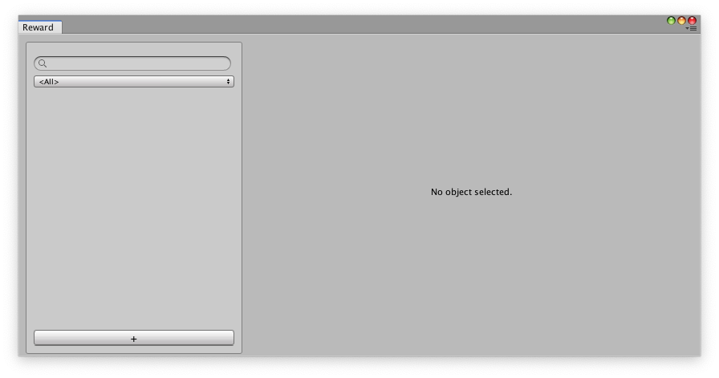
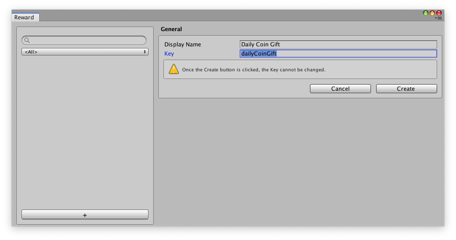
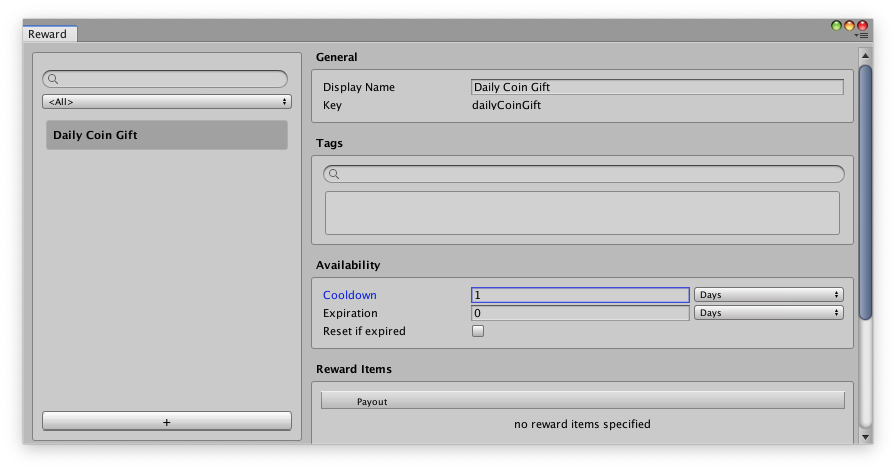
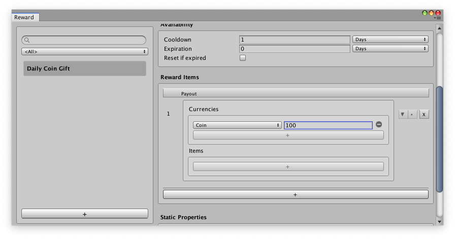
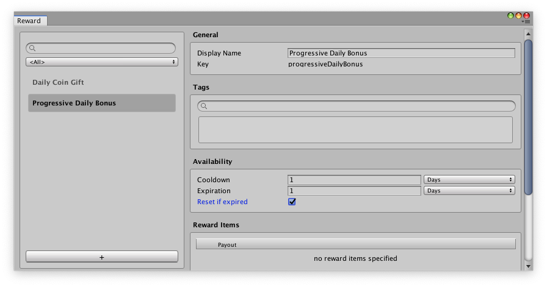
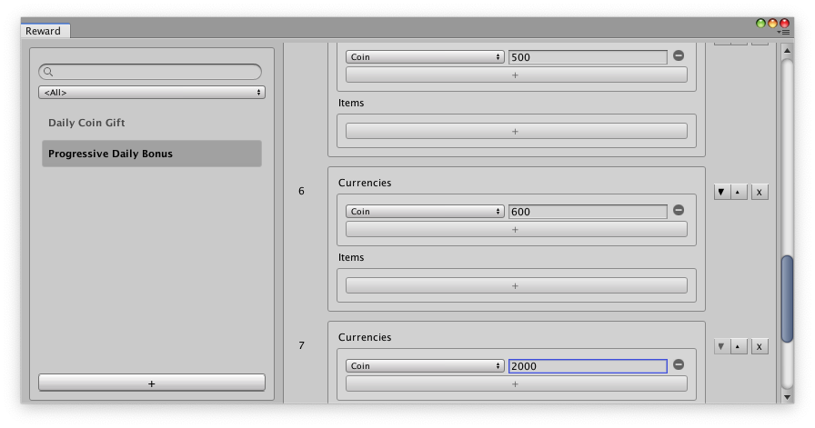

# Game Foundation Tutorials

In a [previous tutorial], we created a soft currency called "coin". Let's build on that knowledge by incentivizing players to come back to the game frequently by giving them a recurring reward. Recurring rewards motivate players to play your game regularly and can positively affect player engagement and retention. 

The Reward System lets you customize rewards by type (for example, coins or other in-game items), frequency of payout, and Availability properties relating to reward cooldown and expiration (learn more about Availability properties in [Reward Definition]). The settings you choose for these properties determine how a player can interact and claim a reward in the game.

To show how to set up a periodic reward, let's follow a scenario of creating a daily reward. In particular, this tutorial covers how to create:
* A simple daily reward of 100 coins per day in your game as a free gift to your players. 
* A progressive reward where the value of the reward increases at each step. 

Creating both a simple daily reward in your game along with a progressive reward is common in many games because it works by rewarding players for playing every day, which may lead to them becoming a loyal player. Follow these step-by-step instructions to get started.

## Creating a simple daily reward

1. In your Unity project, go to __Window__ > __Game Foundation__ > __Reward__.The Reward window will appear, showing the list of rewards already created. If the list is empty, then no rewards have been created yet.  

2. Click the __+__ button to create a new Reward. A form will appear.

3. In the __Display Name__ field, enter "Daily Coin Gift", then tab to the __Key__ field. A key will automatically be generated from the Display Name field,  named "dailyCoinGift". 

4. Click __Create__ to finish creating your new reward.

After creating your new reward, it will appear in the Reward list and will be automatically selected so you can begin defining its properties. Many of these reward item properties or sections may look familiar to you from previous tutorials. However, the sections we'll focus on to create a daily reward will be the __Availability__ and __Reward Items__ sections.

### Availability

The __Availability__ section defines when the reward will be claimable and when it will be locked. This is set through the __Cooldown__, __Expiration__, and __Reset if expired__ properties of a reward item. These properties are described in the [Reward Definition] page. Before filling out these properties, let’s think about the desired frequency of the reward.

We want to limit the daily reward to be claimed only after at least 24 hours has passed since the last time the player claimed the reward. This time period is called the __Cooldown__.

In the __Cooldown__ field, enter "1". The default cooldown unit is in __Days__. Now the cooldown of this reward is set to 1 day.

### Reward Items

The __Reward Items__ section defines what kind of reward to pay out and how much of it. 

Before filling out the __Reward Items__ properties, let’s think about the desired type and quantity of the daily reward. We want the reward to always pay out the same amount of 100 coins per day. Therefore, we only need to create one reward item.

In the __Reward Items__ section, click the __+__ button to create a new reward item. Click the __+__ button under __Currencies__ to add the currency payout of this reward item. Then, choose __Coin__ as the type of payout, and set the amount to 100.

Now that you have finished adding a new, simple daily reward item in Unity, this reward will be usable in your game.

## Creating a progressive daily reward

While creating a simple daily reward can encourage players to play your game every day, creating a progressive daily reward incentivizes the player to play your game more consistently into the future.
This is because the progressive reward gets better as time goes on, usually must be claimed within a certain time frame, and can feel more satisfying to a player the longer they keep playing.
This motivation to keep playing to get better rewards everyday while the reward is available can help convert a casual player into a loyal one in the long-run.

The steps for creating a progressive daily reward are the same as the steps for creating a simple daily reward. The biggest difference is instead of only creating one Reward Item, you can create many. This can be illustrated in the following example.

Progressive rewards usually have an Expiration time, and time limits associated with claiming the reward if the player misses a day. The Expiration and Reset if Expired properties are described in the [Reward Definition] page.

Let’s create 7 reward items to have the daily rewards progress over the course of a week, where each reward item is increasingly more valuable than the previous day. 

To see your progressive reward in action, click ahead to check out the [Reward Prefab] tutorial.

## 
< [_table of contents_](../TableOfContents.md)

[previous tutorial]: 03-CreatingCurrency.md
[Reward definition]: ../CatalogItems/RewardDefinition.md
[Reward Prefab]: 18-WorkingWithRewardPrefabs.md